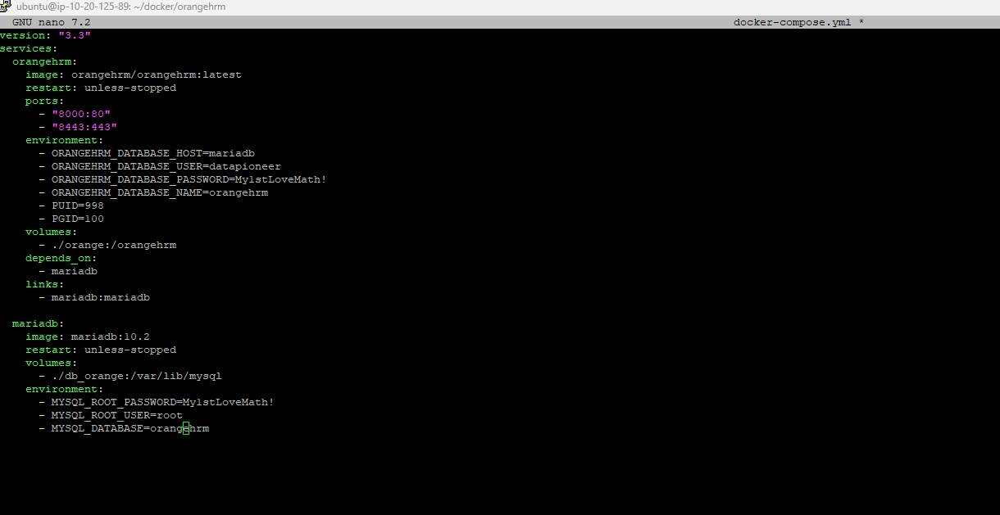
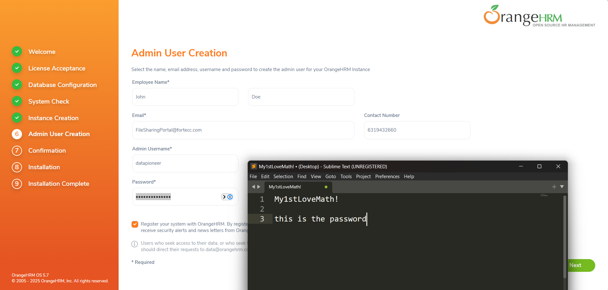
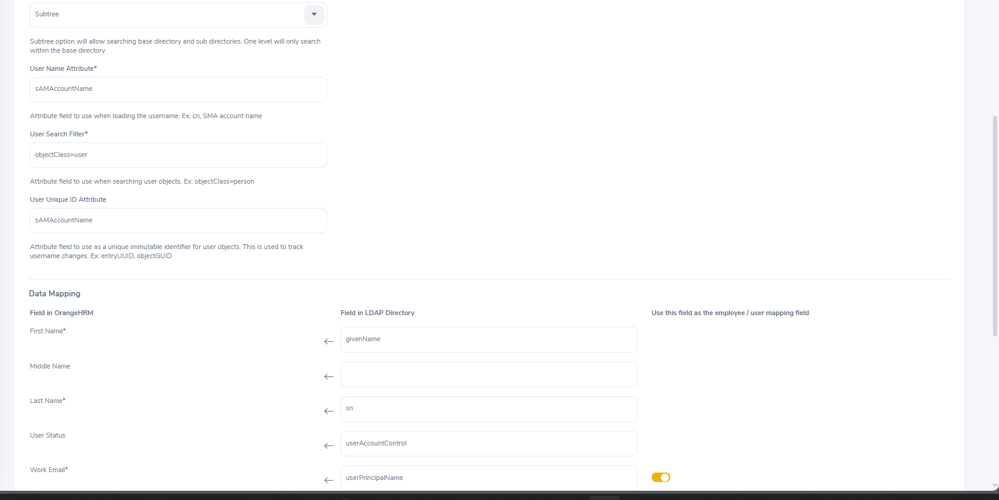
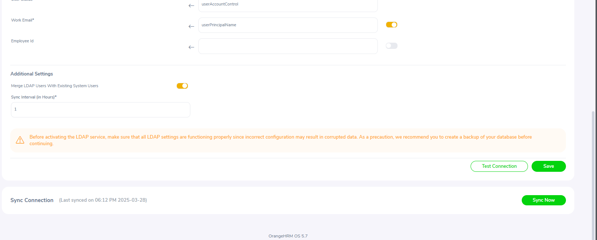

Here’s how to install Docker and Docker Compose on Ubuntu:

### **Step 1: Update System Packages**

```bash
sudo apt update && sudo apt upgrade -y
```

### **Step 2: Install Required Dependencies**

```bash
sudo apt install -y ca-certificates curl gnupg
```

### **Step 3: Add Docker’s Official GPG Key**

```bash
sudo install -m 0755 -d /etc/apt/keyrings
curl -fsSL https://download.docker.com/linux/ubuntu/gpg | sudo tee /etc/apt/keyrings/docker.asc > /dev/null
sudo chmod a+r /etc/apt/keyrings/docker.asc
```

### **Step 4: Set Up the Docker Repository**

```bash
echo "deb [arch=$(dpkg --print-architecture) signed-by=/etc/apt/keyrings/docker.asc] https://download.docker.com/linux/ubuntu $(lsb_release -cs) stable" | sudo tee /etc/apt/sources.list.d/docker.list > /dev/null
```

### **Step 5: Install Docker and Docker Compose**

```bash
sudo apt update
sudo apt install -y docker-ce docker-ce-cli containerd.io docker-buildx-plugin docker-compose-plugin
```

### **Step 6: Verify Installation**

Check Docker version:

```bash
docker --version
```

Check Docker Compose version:

```bash
docker compose version
```

### **Step 7: Enable & Start Docker Service**

```bash
sudo systemctl enable --now docker
```

### **Step 8: Allow Running Docker Without sudo (Optional)**

```bash
sudo usermod -aG docker $USER
newgrp docker
```

---

compose file



---

ref:
[OrangeHRM (open source HRM software Docker App), Installation, Part 1](https://www.youtube.com/watch?v=FWS7KH7os2Y&t=1s&ab_channel=Datapioneer)


---



---





